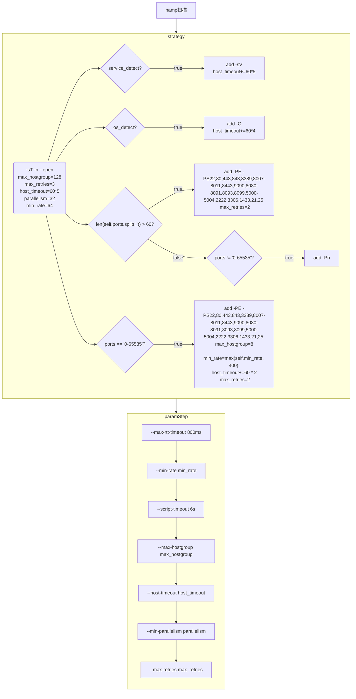

---
categories:
- 网络安全
date: '2022-04-13T06:39:00.000Z'
showToc: true
tags:
- 开发
- 源码阅读
title: 从arl中学习到的nmap配置

---


灯塔（ARL）里面有一个namp扫描模块，里面有配置可以学习一下

首先上代码

```python
class PortScan:
    def __init__(self, targets, ports=None, service_detect=False, os_detect=False,
                 port_parallelism=None, port_min_rate=None, custom_host_timeout=None):
        self.targets = " ".join(targets)
        self.ports = ports
        self.max_hostgroup = 128
        self.alive_port = "22,80,443,843,3389,8007-8011,8443,9090,8080-8091,8093,8099,5000-5004,2222,3306,1433,21,25"
        self.nmap_arguments = "-sT -n --open"
        self.max_retries = 3
        self.host_timeout = 60*5
        self.parallelism = port_parallelism  # 默认 32
        self.min_rate = port_min_rate  # 默认64

        if service_detect:
            self.host_timeout += 60 * 5
            self.nmap_arguments += " -sV"

        if os_detect:
            self.host_timeout += 60 * 4
            self.nmap_arguments += " -O"

        if len(self.ports.split(",")) > 60:
            self.nmap_arguments += " -PE -PS{}".format(self.alive_port)
            self.max_retries = 2
        else:
            if self.ports != "0-65535":
                self.nmap_arguments += " -Pn"

        if self.ports == "0-65535":
            self.max_hostgroup = 8
            self.min_rate = max(self.min_rate, 400)

            self.nmap_arguments += " -PE -PS{}".format(self.alive_port)
            self.host_timeout += 60 * 2
            self.max_retries = 2

        self.nmap_arguments += " --max-rtt-timeout 800ms"
        self.nmap_arguments += " --min-rate {}".format(self.min_rate)
        self.nmap_arguments += " --script-timeout 6s"
        self.nmap_arguments += " --max-hostgroup {}".format(self.max_hostgroup)

        # 依据传过来的超时为准
        if custom_host_timeout is not None:
            if int(custom_host_timeout) > 0:
                self.host_timeout = custom_host_timeout
        self.nmap_arguments += " --host-timeout {}s".format(self.host_timeout)
        self.nmap_arguments += " --min-parallelism {}".format(self.parallelism)
        self.nmap_arguments += " --max-retries {}".format(self.max_retries)

    def run(self):
        logger.info("nmap target {}  ports {}  arguments {}".format(
            self.targets[:20], self.ports[:20], self.nmap_arguments))
        nm = nmap.PortScanner()
        nm.scan(hosts=self.targets, ports=self.ports, arguments=self.nmap_arguments)
        ip_info_list = []
        for host in nm.all_hosts():
            port_info_list = []
            for proto in nm[host].all_protocols():
                port_len = len(nm[host][proto])

                for port in nm[host][proto]:
                    # 对于开了很多端口的直接丢弃
                    if port_len > 600 and (port not in [80, 443]):
                        continue

                    port_info = nm[host][proto][port]
                    item = {
                        "port_id": port,
                        "service_name": port_info["name"],
                        "version": port_info["version"],
                        "product": port_info["product"],
                        "protocol": proto
                    }

                    port_info_list.append(item)

            osmatch_list = nm[host].get("osmatch", [])
            os_info = self.os_match_by_accuracy(osmatch_list)

            ip_info = {
                "ip": host,
                "port_info": port_info_list,
                "os_info": os_info
            }
            ip_info_list.append(ip_info)

        return ip_info_list

    def os_match_by_accuracy(self, os_match_list):
        for os_match in os_match_list:
            accuracy = os_match.get('accuracy', '0')
            if int(accuracy) > 90:
                return os_match

        return {}
```

入口是run

首先是扫描策略的配置



其中涉及到的配置

- -sT 全连接扫描会和服务器建立完整的三次握手

- -n 不做dns解析

- —open 只显示开放或可能开放的端口

- -sV 探测开放端口的服务

- -O 启用操作系统版本探测

- -PE 基于ICMP的echo的主机发现

- -PS[portlist] 基于TCP SYN指定端口的主机发现

- -Pn 跳过主机发现，视所有主机都在线

然后是对于扫描结果的处理

- 如果一个ip的端口开放了600个以上，则只留下80和443端口的信息

