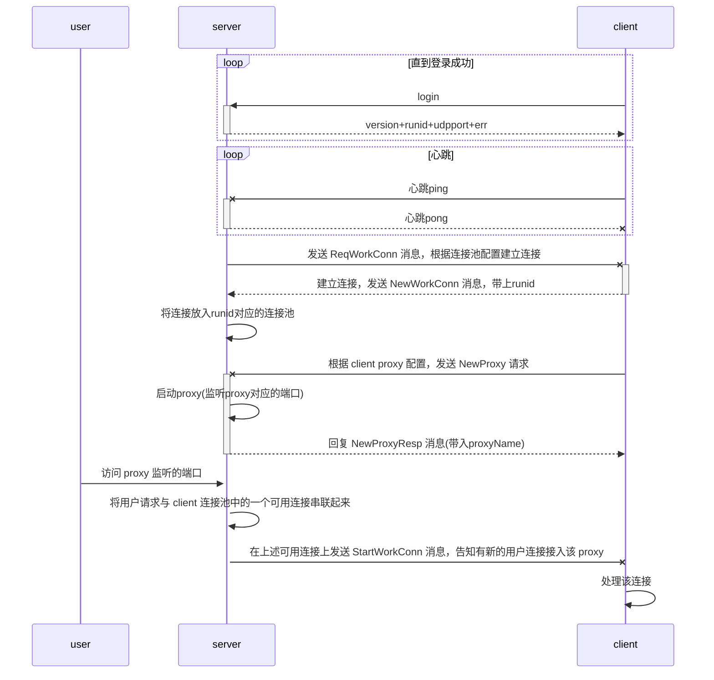

# frp源码阅读

首先根据源码梳理出时序图

frp中 client 和 server 之间的连接有 workConn 和普通连接两类，workConn 主要是为了和用户主动发起的连接打通，而普通连接主要是 client 与 server 之间的业务交流

workConn 会在普通连接建立后，由 server 下发指令给 client，让 client 主动与 server 建立新的连接，server 会根据 runid 将这些连接放入该 client 专有的 workConn 连接池中，这些 workConn 会等待后续的 StartWorkConn 指令

client 会通过普通连接，告知 server 需要启动 proxy，然后 server 端会根据 client 传递过来的 proxy 配置来进行端口监听，如果该端口上监听到用户请求，会从 workConn 连接池中取出一个可用连接，并给 client 发送 StartWorkConn 指令，告知有新的用户连接接入该 proxy

client 在 workConn 接收到 StartWorkConn 指令后，将会根据 proxy 配置来处理 workConn，后续的 用户-server-client 之间的数据将被串联起来。

frp整体采用了channel来处理连接的数据传输，所以整体流程从代码上是很割裂的，需要有耐心地阅读。

其实frp还有很多功能，但是并不影响主流程的理解，此处不一一展开了。

源码阅读注释可查看 [https://github.com/akkuman/readsource-frp-3e721d1/compare/98e0b93...master](源码阅读注释可查看 https://github.com/akkuman/readsource-frp-3e721d1/compare/98e0b93...master)
